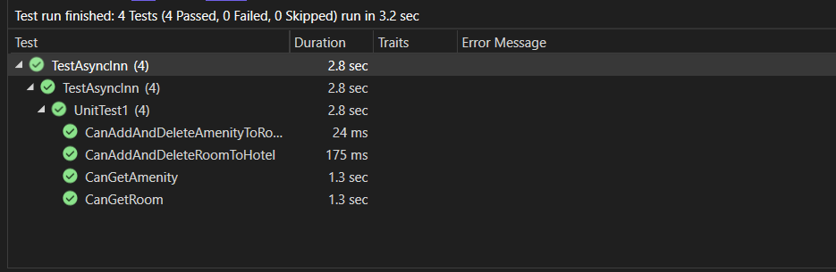
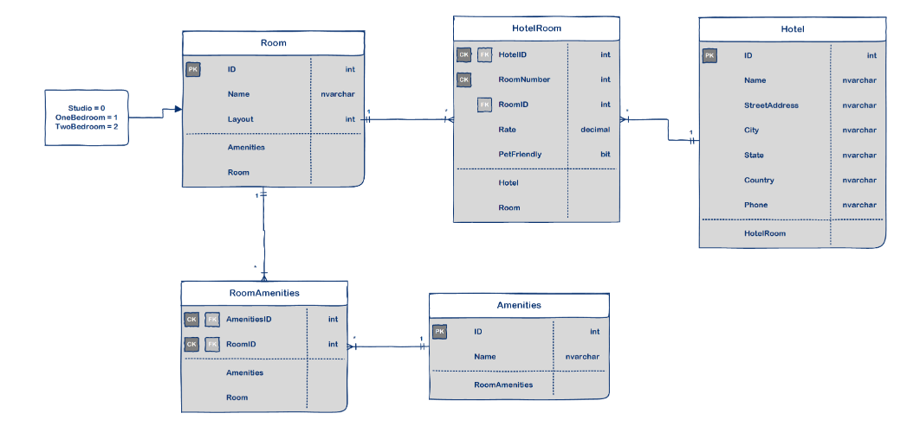

#  Async-Inn

## Name: Yaman Ayoun
## Date: 5/8/2023.

## In Lab 17:

## Unit Testing:



     [Fact]
        public async Task CanAddAndDeleteRoomToHotel()
        {
            // Arrange
            var hotel = await CreateAndSaveTestHotel();
            var room = await CreateAndSaveTestRoom();

            var services = new HotelRoomServices(_db);

            // Act
            await services.AddRoomToHotel(hotel.Id, new HotelRoom
            {
                HotelID = hotel.Id,
                RoomID = room.Id,
                Rate = 5,
                RoomNumber = 110,
            });

            // Assert
            var actualHotelRoom = await services.GetHotelRoom(hotel.Id, 110);
            Assert.Equal(room.Id, actualHotelRoom.RoomID);

            // Act
            await services.DeleteRoomFromHotel(room.Id, hotel.Id);

            // Assert
            var deleted = await services.GetHotelRoom(hotel.Id, room.Id);
            Assert.Null(deleted);
        }

        
        
        [Fact]
        
        public async Task CanAddAndDeleteAmenityToRoom()
        {
            // Arrange
            var amenity = await CreateAndSaveTestAmenity();
            var room = await CreateAndSaveTestRoom();

            var services = new RoomServices(_db);

            // Act
            await services.AddAmenityToRoom(room.Id, amenity.Id);

            // Assert
            var actualRoom = await services.GetRoom(room.Id);
            Assert.Contains(actualRoom.Amenities, r => r.Id == amenity.Id);

            // Act
            await services.RemoveAmentityFromRoom(room.Id, amenity.Id);

            // Assert
            actualRoom = await services.GetRoom(room.Id);
            Assert.DoesNotContain(actualRoom.Amenities, r => r.Id == amenity.Id);
        }
        [Fact]
        public async Task CanGetAmenity()
        {
            // Arrange
            var amenity = await CreateAndSaveTestAmenity();

            var service = new AmenityServices(_db);

            // Act
            var actAmenity = await service.GetAmenity(amenity.Id);

            // Assert
            Assert.NotNull(actAmenity);
            Assert.Equal(amenity.Id, actAmenity.Id);
            Assert.Equal(amenity.Name, actAmenity.Name);
        }


        [Fact]
        public async Task CanGetRoom()
        {
            // Arrange
            var room = await CreateAndSaveTestRoom();

            var service = new RoomServices(_db);

            // Act
            var actualRoom = await service.GetRoom(room.Id);

            // Assert
            Assert.NotNull(actualRoom);
            Assert.Equal(room.Id, actualRoom.Id);
            Assert.Equal(room.Name, actualRoom.Name);
            Assert.Equal(room.Layout, actualRoom.Layout);
        } ``


#  Async-Inn

## Name: Yaman Ayoun
## Date: 31/7/2023.

## In Lab 16:

1. Add in Async Inn application by cleaning up input and outputs of your controllers to be DTOs.

build DTOs stand for data transfer objects for this class:

* Amenities
* Rooms
* HotelRooms
* Hotels
```
    public class HotelDTO
    {
        public int ID { get; set; }
        public string Name { get; set; }
        public string StreetAddress { get; set; }
        public string City { get; set; }
        public string State { get; set; }
        public string Phone { get; set; }
        public List<HotelRoomDTO> Rooms { get; set; }
    }


    public class HotelRoomDTO
    {
        public int HotelID { get; set; }
        public int RoomNumber { get; set; }
        public decimal Rate { get; set; }
        public bool PetFriendly { get; set; }
        public int RoomID { get; set; }
        public RoomDTO Room { get; set; }
    }

    public class RoomDTO
    {
        public int ID { get; set; }
        public string Name { get; set; }
        public string Layout { get; set; }
        public List<AmenityDTO> Amenities { get; set; }
    }

    public class AmenityDTO
    {
        public int ID { get; set; }
        public string Name { get; set; }
    }
```

2. Update the Interface for each class becouse we need use DTO Classes.

3. Update services and controller API.

## Date: 26/7/2023.

## In Lab 14:

* GET all the rooms for a hotel: /api/Hotels/{hotelId}/Rooms
* POST to add a room to a hotel: /api/Hotels/{hotelId}/Rooms
* GET all room details for a specific room: /api/Hotels/{hotelId}/Rooms/{roomNumber}
* PUT update the details of a specific room: /api/Hotels/{hotelId}/Rooms/{roomNumber}
* DELETE a specific room from a hotel: /api/Hotels/{hotelId}/Rooms/{roomNumber}


## Name: Yaman Ayoun
## Date: 23/7/2023.

## In Lab 13:

1. I implemented Dependency Injection to enhance the structure of my Hotels, Rooms, and Amenities Controllers. This was achieved by making these controllers depend on interfaces.

2. To begin, I created interfaces for each of the controllers, ensuring that these interfaces contained all the necessary method signatures for performing CRUD operations directly to the database.

3. Next, I modified each of the controllers to inject the corresponding interface.

4. For seamless integration, I developed a service for each of the controllers that implemented the respective interface.

5. With these changes in place, I updated the Controller to utilize the appropriate methods from the interface instead of directly accessing the DBContext.

## Name: Yaman Ayoun
## Date: 19/7/2023.

### Introduction
This web app is for a hotel management system. Users can view the hotels, rooms, and the amenities available either by retrieving all data of each table or by getting a specific one using it's ID.

## Async-Inn ERD 


## I have Implemente this table:
* Hotel: the hotel has an ID, name, street address, city, state, country, and phone. All of these are provided in the requierments.

* Room: so this room has a unique ID and other properites such as name and layout.

* Amenities: it has an ID and a name. It navigates to RoomAmenities table since the relationship between them is a many to many.


